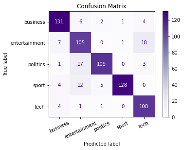

# Articles Categorization
## Description
- This purpose of this project is to categorize articles into five categories which is **Bussiness, Entertainment, Politics, Sport and Tech**.

## Python Scripts/Files
- **acmodule.py**
  - This is the module containing functions to be used in the **train.py** script
- **train.py**
  - This is the python script that trains a Recurrent Neural Network Model using embedding, LSTM and bidirectional layers.

## Directories
- *database*
  - This folder contains the data to be trained which were loaded from the URL: https://raw.githubusercontent.com/susanli2016/PyCon-Canada-2019-NLP-Tutorial/master/bbc-text.csv
- *logs*
  - This folder contains the log files required to view tensorboard.
  - Some of the training log files may not be included as there are a lot of files and I do not want it to clutter my changed files for git commit.
- *report*
  - This folder contains the information of settings configured and the performance the model gets.
- *reports_data*
  - This folder contains all the data in form of a dictionary that consists of settings and performance for that config.
- *saved_models*
  - This folder contains the model, tokenizer data and other objects related to this project.
- *static*
  - This folder contains image files related to this project

## Tensorboard
- How to run tensorboard
  1. Open Anaconda promt
  2. Activate the specific environment
  3. Type `tensorboard --logdir <path>`
    - replace `<path>` with the path to the logs folder

# Exploratory Data Analysis
- Data are loaded from given the URL: https://raw.githubusercontent.com/susanli2016/PyCon-Canada-2019-NLP-Tutorial/master/bbc-text.csv
- The data contains two columns named:
  - `category`: This is the target for classification/categorization
  - **Processes it goes through**:
    1. Get unique category name
    2. Get total number of the unique categories
    3. Encoded using OneHotEncoder by scikit-learn
  - `text`: This column contains text information which would be further processed before passing through the deep learning model.
  - **Processes it goes through**:
    1. Remove non-alphabetical characters using regex, lowercase the alphabetical characters and split the words for every sample of data
    2. Data vectorization
    3. Get tokenizer
    4. Get padding sequences with a certain max length (400 as average number of words in the cleaned text data)

# Deep Learning Model
- The deep learning model are created with `Sequential`, the layers included in the model are Embedding, Bidirectional, LSTM, Dropout and Dense.
- Model are created with the help of a function from **acmodule.py**
- Using the provided function, we can alter a few arguments to see the difference in the models' performances.

## Model Performance

- This is the model performance during training plotted using matplotlib.

- This is the model performances during training viewed in tensorboard.
- Multiple log files where different model configurations are viewed also in tensorboard.

- The above confusion matrix is plotted by one of the high performing model which can predict the true label with great accuracy.

- This is one of the classification report that I get.