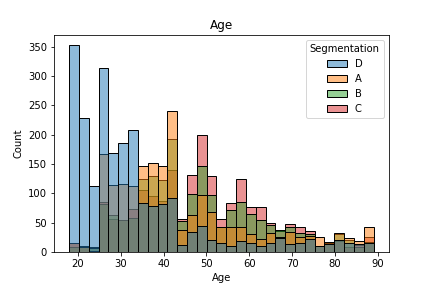
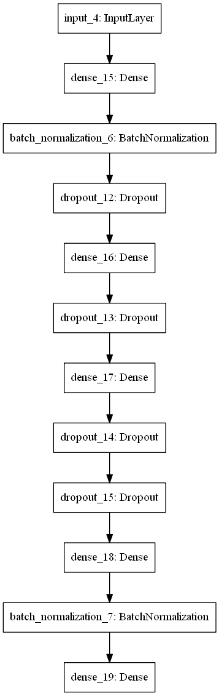

# Customer Segmentation
## Description
- This is a multi-class classification where customers are classified into 4 segments 
(A, B, C, D) based on their customer’s gender, age, profession, spending pattern, and etc.

## Python Scripts
- **train.py**
  - This script trains the deep learning model and save important settings to be used in the deploy script.
- **deploy.py**
  - This script is for predicting new data by accessing the model and other objects saved from train script so that the customer segmentation at `new_customer.csv` can be predicted.
- **cs_lib.py**
  - This file is a library containing functions to be used in the train and deploy scripts.

## Directories
- *saved_objects*
  - This is where the deep learning model and other objects are saved such as the encoders, imputer and scaler.
- *static*
  - This folder contains image files related to this Customer Segmentation project.
- *database*
  - This folder contains the dataset related to the project.
  - **train.csv**
    - This is the data for training the model
  - **new_customers.csv**
    - This is the test data to get the label for customer's segmentation (class label)
  - **new_customers_results.csv**
    - This is the test data with customer's segmentation target label

## How to run Tensorboard
- To run Tensorboard,
  1. Open Anaconda promt
  2. Activate the specific environment
  3. Type `tensorboard --logdir <path>`
    - replace `<path>` with the path to the logs folder

# Exploratory Data Analysis
- Load the data from `train.csv`

## Missing values

- There are lots of missing values in the dataset
- These missing values will be cleaned using the KNNImputer after all the categorical features are encoded to numerical data

## Duplicated samples/rows
- No duplicated samples in `train.csv`

## Relationship between features & target
- Figures below shows the relationship between each feature and segmentation labels (A, B, C , D)

- For this project, all the features are used in training the deep learning model.

# Deep Learning Model
## Model Architecture

- This is the architecture of the deep learning model for this project.
## Model Performance
- Overall, the model training seems to have average accuracy score of 50%+
- Even after trying to improve the deep learning model by adding more neurons or layers, increasing epoch and reducing learning rate. The accuracy score does not get pass 60%.
- Machine learning model is not tested for this project yet.

## Tensorboard (training graph)

## References
Dataset retrieved from: https://www.kaggle.com/datasets/abisheksudarshan/customer-segmentation