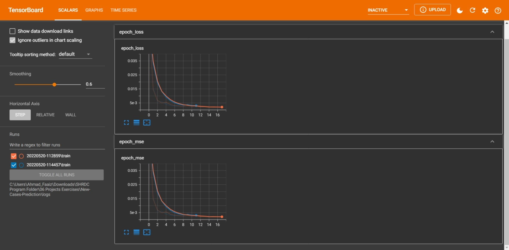

# New Cases Prediction
## Description
This project analyse the past cases of 30 days in Malaysia to predict number of new cases using a deep learning model with LSTM neural network.

## Python Scripts
- `train.py`
  - This is the main script for training the deep learning model and analyse the model performance by getting the mean absolute percentage error and plotting the predicted and actual cases with test data.
- `ncmodule.py`
  - This module contains the functions needed for the main script to run.
## Directories
- `database`
  - This is the folder containing the dataset of both train and test data.
- `logs`
  - This folder contains the log files for tensorboard.
- `saved_objects`
  - This folder contains the saved model and the scaler object for future deployment purposes.
- `static`
  - This folder contains the image files related to this project.
## Tensorboard
- How to run tensorboard
  1. Open Anaconda promt
  2. Activate the specific environment
  3. Type `tensorboard --logdir <path>`
    - replace `<path>` with the path to the logs folder

## EDA
When the train dataset and test dataset are loaded. There are some non-numerical data and missing values that needed to be treated before passing it to the deep learning model.

### EDA steps:
1. Convert non-numerical data to missing values in new_cases column for train dataset.
2. Impute missing values with linear interpolation method
  - Plot the graph to visualize the data (as references)
3. Get train and test data with window size of 30 days to be trained to the deep learning model.

## Deep Learning Model

- This is the model architecture used for this project.
- Loss and metrics used for this model are the mean squared error (MSE).
### Model Performance

- This is the training graph viewed in tensorboard.

- The mean absolute percentage error for the model created is less than `1%`.

## Results

- The above image shows the predicted and actual cases in minmax scale.

- The above image shows the predicted and actual cases in the original scale.
## References
Data retrieved from: https://github.com/MoH-Malaysia/covid19-public